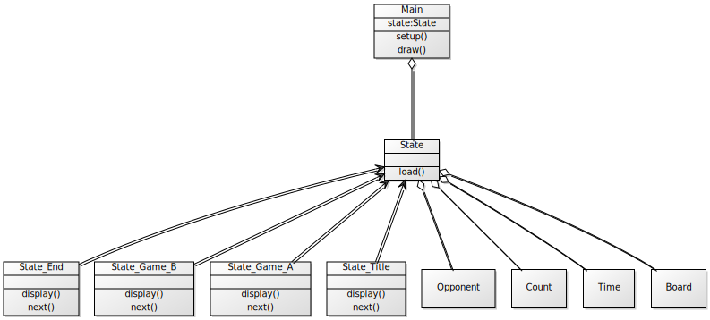

# 企画書

#### 制作者

5415031 癸生川裕紀


5415062 田中太樹


5415082 森田瑛仁


5416001 天本大陽


## 作品の目的

 高齢者向けに認知症予防を目的としたゲームを作成する。ゲーム自体は常日頃からやりつづけるというよりも暇な時にちょこっとやれる、手軽にやれることを目的に制作したい。また一人で黙々とやるよりも保育園児くらいのお孫さんや知人たちと競えるようにしてコミュニケーションの話題の一つになるようなものにしたい。


## 作品構想

-   時間がかかっても達成するというのを大切にしたいので制限時間は設けない。しかしこれでは張り合いがなくつまらなくなってしまう可能性もある。そこで難易度やクリアタイムやマウス操作かキーボード操作かといった要素を参考にポイントをつける。こうすることにより以前の自分との比較や知人や孫といった他の人たちと競えるようにする。

-   脳トレ系なのでマリオなどのアクション要素よりもこちらから指示を出してそれに合致するものを選択してもらうといったゲームにしていく。

- 認知症予防には脳トレに加え体を使うこと、指先を利用することも効果がある。パソコンで体を使うことは現実的に不可能なのでせめて指先は使うようにしたい。そのため、難しくなりすぎない範囲でマウス操作とキーボード操作の両方を利用していく。

- 高齢者には長時間のプレイは大変と思われるので、1ゲームが短時間で終わる、または中断機能をつける ---> ミニゲームのオムニバス形式にする

- 高齢者の興味関心がありそうなコンテンツをキャラクターとして登場させる（和食、ボードゲーム、家族、・・・）

## 作品の独創的な点

- 高齢者目線で設計されるUIでかんたん操作 : 操作説明のフォントにこだわり、サイズも大きくして高齢者向けに見やすいように工夫する。もしくはフォントサイズ調整用ボタンを設置する。

- ステージ制のゲームで同じことを繰り返すだけの作業感を減らしユーザーが飽きないようにしている。


## システム設計
- Stage 1(1周目) : 横から近づいてくる敵( 笹団子 )をジャンプでよけるキーボード横スクロールゲーム
---> 反射神経を鍛えることで脳トレになる
- Stage 2(1周目): 上から降ってくる敵( 囲碁盤 )をよけるマウススクロールゲーム
---> 反射神経を鍛えることで脳トレになる
- Stage 3(1周目): 発射した球で敵を消すシューティングゲーム
---> 発射された球と動く敵の位置を予測することで脳トレになる
 
2周目以降、周ごとに敵の数が増える。
Gameclearできた場合次のStageへ進む。
Gameoverの場合Stage1のTitleへ戻る。

また、scoreを加算して、集計したscoreポイントをGameover画面で表示する。

#### プロジェクト概要

Processingで作成したプログラムを processingjs.org よりダウンロードした変換用スクリプトとともに`assets`内に格納しておく。
`docs/index.html`内の`<script>`要素で変換用スクリプトを読み込み、`<canvas>`要素で`/assets/{sketch}/***.pde`を実行して描画する。


```
DIRECTORY TREE


.
├── images..................添付画像など
│   ├── xxx.png
│   ~
│   └── uml.svg.............UML図
├── docs
│   ├── index.html..........公開用Webページ
│   ├── readme.md...........説明用ドキュメント
│   ~
│   ├── tree.html...........ソースコード[RAW]公開用ぺージ
│   └── index.md............公開用Webページ草稿
└── assets
    ├── processing.js.......変換用スクリプト
    ├── processing.min.js...変換用スクリプト(縮小版)
    └── sketch_0xx..........ゲームプログラム
        ├── data............フォント格納用フォルダ
        ├── aaa.pde
        ~
        └── ccc.pde
        
        
 
        

```


#### ゲームプログラム詳細
状態を表す`State`クラスおよびその派生クラスを繰り返し実行してゲームの状態遷移を表現する。
ゲーム内の要素は`State`クラスで定義して、派生クラスで共通に使えるようにする。





## 制作計画
  
- 授業で作成したものを参考にすることにより製作コストを下げているので一人一つ簡単なものを作るようにする。それらを組み合わせ最終的に全体でブラッシュアップしていく。
#### メモ共有 :

- Slack https://digicon1.slack.com/

- Poolsketch http://plsk.net/digicon2018


#### プロジェクト共有 :
- Github

#### UML描画ツール :
- yuml.me


#### 制作予定日時 :

- 毎週土曜12:00- など

作成計画スケジュール
|6月末 | 企画書|
|-|-|
|7月6日 | ゲーム作成|
|7月13日| ゲーム作成|
|7月20日 | 作品公開ページ草稿|
|7月27日 |作品公開ページ完成|


<!--stackedit_data:

eyJoaXN0b3J5IjpbNTQxNTIxODY3LC0xMzUwMDAwOTA1LDEyNj

cxNTg2NjMsLTIyMDE3MDMzNSwtMTIzNzYxNjk2NiwtMTc4Mjc5

OTY5OF19

-->

<!--stackedit_data:

eyJoaXN0b3J5IjpbLTgxODY5MjUyNSwtODE4NjkyNTI1LDEzMz

k4ODM1MjksLTg4NzI3NDQ3MywtNDkwNTkyODU1LDE5MTA5MzMx

OSwtMTQ5OTk1ODU4MF19

-->
<!--stackedit_data:
eyJoaXN0b3J5IjpbLTEzNzM1MjgzNzIsMTAyMTAyMDU4NSwtMj
gzNjMwOCw3MTUzMTAxLC0xNzkxMTkxNjQ2LDY1OTgyOTcyMCwt
MTU4NjQ4ODM4OSwyMDY3ODg3ODIwLC0xMjg0MzQ1ODM1LDIxMD
AxOTU5ODJdfQ==
-->